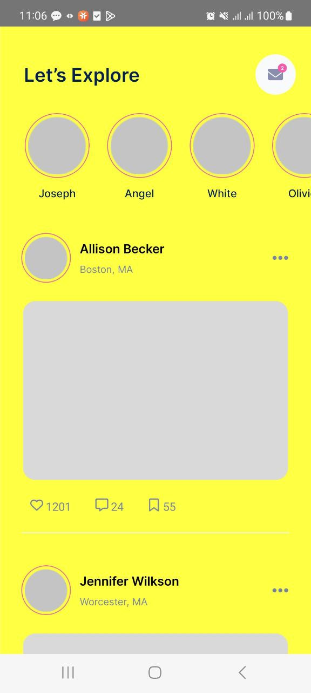

  
  
  

  
  
  

## Features
- "@react-navigation/drawer": "^6.6.3"
- "@react-navigation/material-top-tabs": "^6.6.3"
- "@react-navigation/native": "^6.1.7"
- "@react-navigation/stack": "^6.3.17"
- "react": "18.2.0"
- "react-native": "0.73.1"

### Handle onEndReached for Flatlist 
### Section 14: Building Responsive UIs

## Link Figma: 
https://www.figma.com/file/3IimR3xjVIwe6y7ZlZ8WsG/Social-Media-Mobile-App-(Community)?type=design&node-id=0-1&mode=design&t=uS2YTRxh8IUQ2vnG-0

## Link Source: 
https://www.udemy.com/course/react-native-mobile-app-development/learn/lecture/40005504#learning-tools

